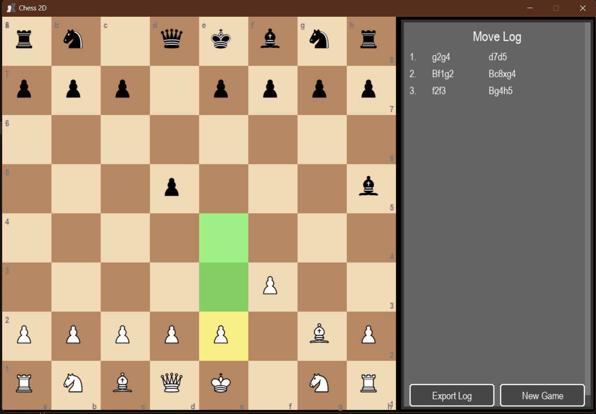

# Chess 2D
[](https://www.python.org/)
[](LICENSE)
[](https://www.gnu.org/licenses/gpl-3.0)
[]()
[]()

<div align="center">
  
  <h1>♔ Chess 2D ♚</h1>
</div>

A feature-rich chess game implementation in Python using Pygame with Stockfish AI opponent and sound effects.



New verion : https://github.com/Gueni/Chess2D/blob/master/dist/chess_game.zip

## Features

- **Complete chess rules implementation**:
  - All piece movements (including en passant and castling)
  - Check/checkmate detection
  - Pawn promotion
  - Move validation
- **Stockfish AI integration**:
  - Adjustable difficulty levels
  - Human vs AI or AI vs AI modes
  - Configurable thinking time
- **Sound effects**:
  - Move sounds
  - Capture sounds
  - Check/checkmate notifications
  - Promotion sounds
- **Clean graphical interface**:
  - Chess board with coordinates
  - Move highlighting
  - Scrollable move history log
  - Game status display
- **Fallback graphics** when piece images aren't available
- **PyInstaller compatible** resource loading

## Requirements

- Python 3.6+
- Pygame
- python-chess (for Stockfish integration)
- Stockfish engine (included in repository)

## Installation

1. Clone the repository:
```bash
git clone https://github.com/gueni/Chess2D.git
cd Chess2D
```

## How to Play

- Left-click on a piece to select it (valid moves will be highlighted)

- Click on a highlighted square to move the selected piece

- When promoting a pawn, click on the desired piece type

- Press ESC to cancel selection

## Controls
 - Mouse: Select and move pieces

 - ESC: Cancel current selection

## ToDo
 - Added scroll functionality for move history console
 - Implemented look menu in console UI
 - Fixed various button interaction bugs
 - Improved pawn promotion menu stability
 - Enhanced move validation edge cases